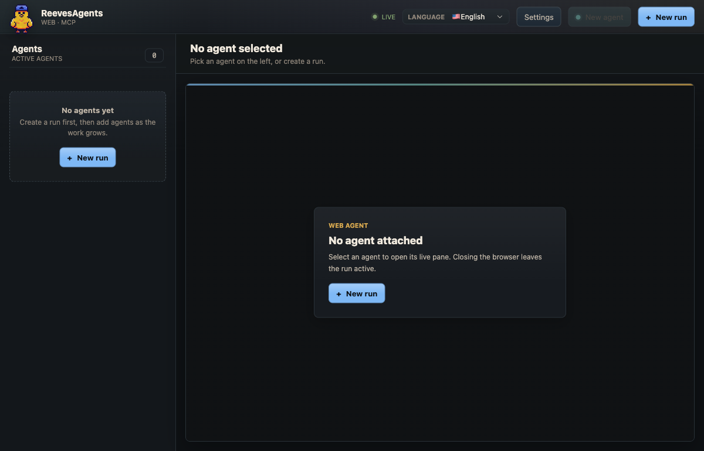

# reevesagents: a workspace for AI coding tools

Run Claude Code, Codex, Kimi, OpenCode, Hermes and other AI coding tools side by side on your computer. reevesagents keeps their terminal sessions together so you can inspect each tool's work, send instructions and stop a run from one place.

[See the demo](https://reevesagents.mertkayacs.com/demo/) or install the command-line tool below.

## Quick start

Requires Node.js 20.19 or newer, tmux 3.0 or newer, and an installed, authenticated AI coding tool. Supports macOS, Linux and WSL. tmux keeps the tools running when you close the interface.

```sh
npm install -g reevesagents && reevesagents doctor && reevesagents
```

This opens the terminal interface. For the browser interface, run `reevesagents web`; it listens only on your computer's loopback address.

## Run a team

Start a run with a task for the tools:

```sh
reevesagents spawn claude-code:lead codex:tests --name "review" --prompt "Review the code and tests."
```

Use the terminal or browser interface to read output and steer each tool. Each provider keeps its own login and sends its own model requests. Run state is stored as JSON under `~/.reeves`.

## Let one tool direct the others

Attach the optional Model Context Protocol (MCP) server, a standard connection between AI tools, to a host you trust:

```sh
reevesagents attach claude && reevesagents hosts
```

Restart that host to load the connection. It can then start, read, steer and stop other tools. Workers receive no MCP connection by default. Keep provider permission prompts enabled and review approvals before sensitive actions.

The [reevesagents skill](https://github.com/mertkayacs/reevesagents-skill) supplies the host's operating instructions. See the [MCP reference](docs/mcp.md) for tools and host requirements.

## Choose an interface

| Interface | Purpose |
| --- | --- |
| Terminal UI | Inspect and control runs with the keyboard |
| Web UI | Inspect runs, live output, approvals and history in a browser |
| Command line | Start runs and inspect output from scripts |
| MCP server | Let a trusted AI coding tool control a team |

<details>
<summary>Web UI screenshot</summary>



</details>

## Documentation

- [User guide](https://reevesagents.mertkayacs.com/docs/): installation, commands and configuration.
- [FAQ](https://reevesagents.mertkayacs.com/faq/): provider setup and troubleshooting.
- [MCP reference](docs/mcp.md): tools and host connections.
- [Contributing](.github/CONTRIBUTING.md), [testing](docs/testing.md) and [changelog](CHANGELOG.md).

Translations: [Deutsch](docs/i18n/README.de.md), [Français](docs/i18n/README.fr.md), [Español](docs/i18n/README.es.md), [Português](docs/i18n/README.pt.md), [Italiano](docs/i18n/README.it.md), [Türkçe](docs/i18n/README.tr.md), [Русский](docs/i18n/README.ru.md), [简体中文](docs/i18n/README.zh-Hans.md), [العربية](docs/i18n/README.ar.md). These are separate README translations.

## License

[Apache-2.0](LICENSE). Available on [npm](https://www.npmjs.com/package/reevesagents).

An [Eschatia Labs](https://eschatialabs.com) project by [Mert Kaya](https://mertkayacs.com).
